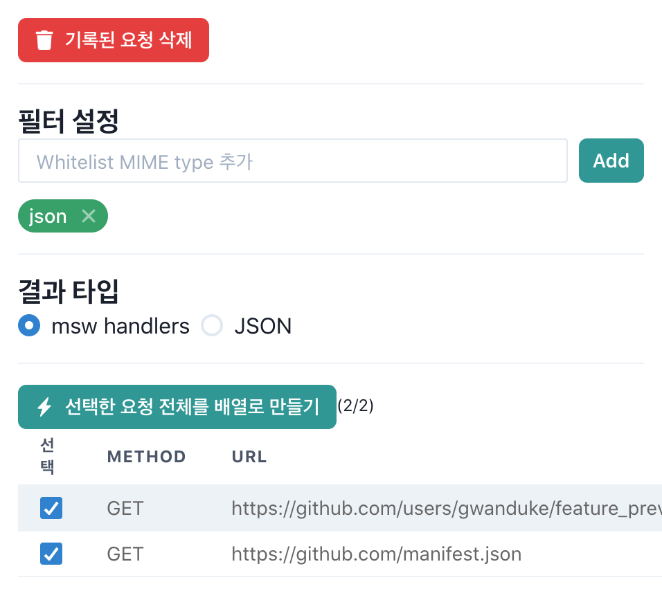
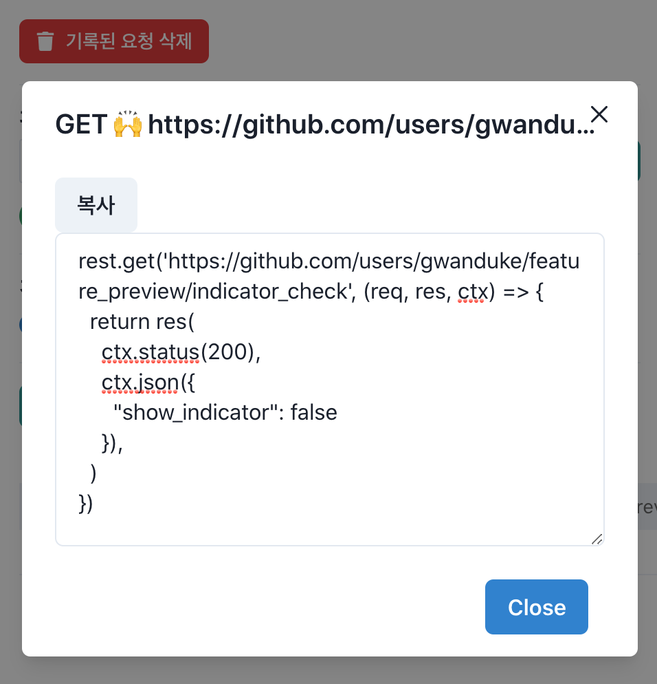

#  Falcon, the network tracker

> Network Request => JSON or test code

This **chrome extension** collects network requests and you can copy them into test code or JSON format.

브라우저에서 보내졌던 네트워크 요청과 그 결과를 모아서 테스트 코드 또는 JSON 포맷으로 복사할 수 있도록 해주는 **크롬 익스텐션**입니다.

- 지원되는 포맷
  - JSON
  - [msw](https://mswjs.io/) handler

## 사용방법

- https://chrome.google.com/webstore 에서 `Falcon, the network tracker` 검색 (현재 심사 대기중이라 보이지 않음)
- 크롬 브라우저에서 Chrome Developer Tool 열기 (<kbd>F12</kbd> or <kbd>cmd</kbd> + <kbd>option</kbd> + <kbd>i</kbd>)
- 탭에서 `Falcon` 선택

### 미리보기

- Network 요청 및 결과 기록

  

- JSON 또는 msw handler로 코드 복사 (복사된 코드를 테스트 코드에 활용)

  

## 예제

- [react-msw example](./example/react-msw)

## 소개

### 등장 배경

코드 수정과 리팩토링은 버그를 유발할 수 있습니다. 그렇기 때문에 가능하면 테스트를 작성하고 수정을 하는 것이 좋습니다. 하지만 기존 코드에 테스트를 붙이는 것은 쉽지 않습니다. 유닛테스트가 불가능한 경우가 많고 유닛테스트를 하려면 코드를 수정해야하는데 코드 수정은 앞서 말했듯 버그를 발생시킬 수 있기에 소극적이게 됩니다. 어쩌면 새로 작성하는게 좋겠다는 생각이 들지만 글쎄요... 앱이 기존처럼 동작하지 않으면 어떡하죠?

그래서 우리는 통합테스트를 작성합니다. 통합테스트는 상세 구현을 신경쓰지 않고 테스트할 수 있게 해줍니다. 일단 작성해두면 내부 구현을 리팩토링하는데 훌륭한 피드백 루프를 제공합니다.

하지만 수많은 조건과 커버해야하는 양 때문에 유닛테스트에 비해 통합테스트 작성은 쉽지않습니다. 특히, 외부 API를 mock하는 일은 굉장히 고통스럽기만 합니다. 테스트 작성은 비교적 쉽지만 테스트가 수행되어야하는 환경을 구성해는 것이 정말 어렵고 복잡합니다.

`🦅Falcon`은 통합테스트 작성시 겪는 여러 문제 중 **API를 mock하는 절차를 단순화**하기 위해 탄생했습니다.

### 언제 도움이 될까요?

- 🤮 새로 작성해야하는 코드 (앱 사용이 불가능하고 브라우저에서 네트워크 요청을 확인할 수 없으므로, `🦅Falcon`이 도움을 주지 못합니다)
- 👍 이미 작성된 프로그램에 테스트를 붙일 때 (그리고 리팩토링이나 기능을 추가할 때)

이미 작성된 프로그램에 테스트를 붙인다면 우리는 앱을 실행해가며 **브라우저의 devtool - Network 탭을 통해서 요청을 복사-붙여넣기**하여 Mock API를 구성할 수 있습니다. 기존에 많은 분들이 이렇게 요청을 하나씩 복사해가며 mock data를 구성했을거라 생각합니다.

`🦅 Falcon`은 이렇게 요청을 하나씩 복사했던 과정을 손쉽게 할 수 있도록 도와줍니다. 🎉

### 활용 방법

- 레거시 코드를 테스트할 때
- 코드 수정/리팩토링에 테스트를 통한 피드백 루프를 받고 싶을 때
- 발생한 버그에 대한 검증을 위해 시나리오 테스트를 작성할 때

## 왜 Falcon인가요?

매(Falcon)가 날아간 리퀘스트를 다시 물어온다는 컨셉입니다 :)

## 그 외

자세히 보기

### Stack

- ReactJS
- chakra-ui

### TODOs

- [ ] JSON 템플릿팅
- [ ] miragejs 등의 테스트 도구에 대한 코드
- [ ] 필터링 코도화
- [ ] UI/UX 개선

