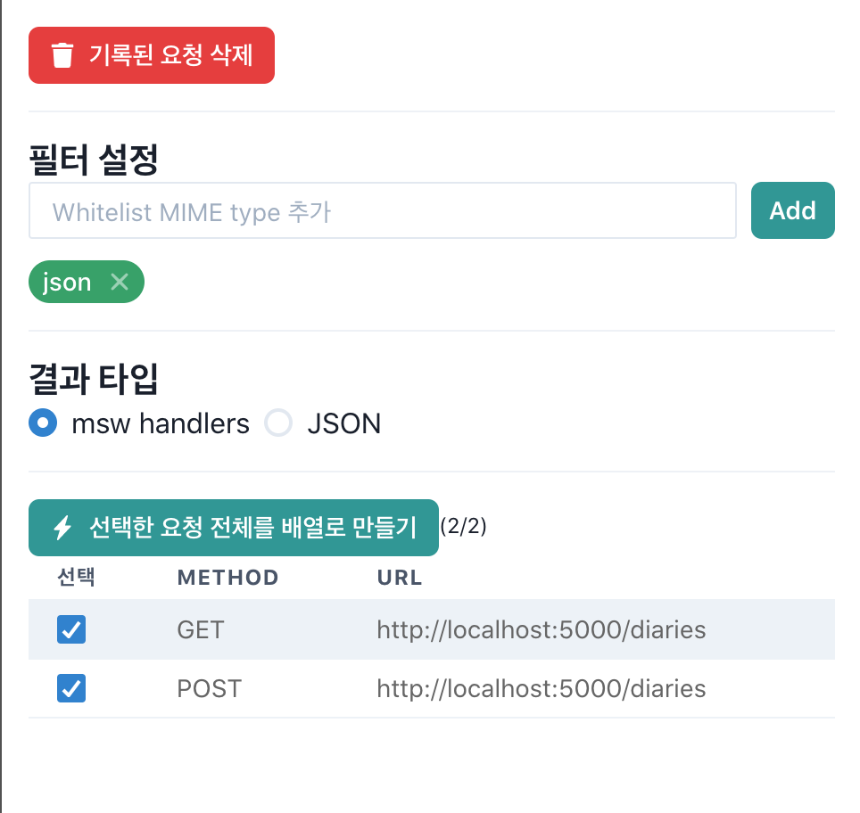
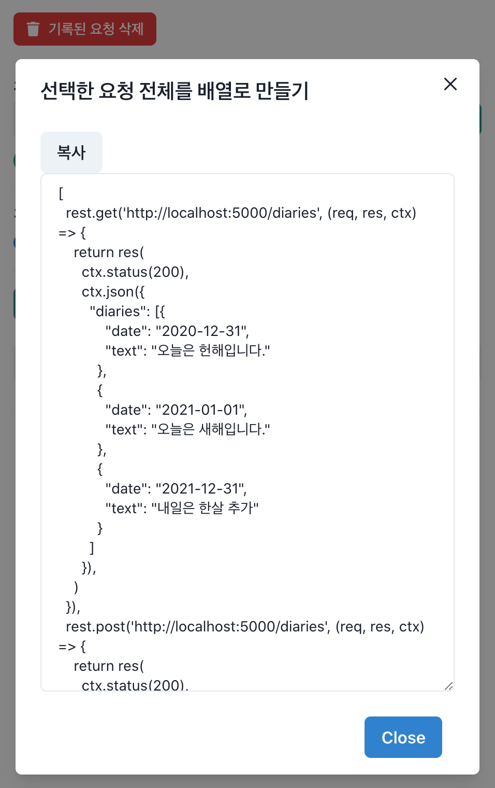

# Falcon msw Example

> [msw](https://mswjs.io/)를 이용한 통합테스트를 작성하는데 어떻게 도움을 줄 수 있는지 간단하게 만들어본 예제입니다.

## 예제 확인 방법

1. `yarn start`
2. [http://localhost:3000](http://localhost:3000) 확인
3. [src/App.test.js](./src/App.test.js) 내 설명 확인
4. `yarn test`해 테스트 동작 확인

## msw를 위한 MockAPI 작성 순서

1. [http://localhost:3000](http://localhost:3000)에 접속해 `🦅Falcon`을 켭니다.
2. 다음 시나리오대로 브라우저에서 동작을 수행합니다.
   ```plain
   (예시)
   - 1. `yarn start`로 앱을 실행 (로딩 후 아이템이 3개 표시됨 확인)
   - 2. "내용" input에 "새로만든 일기"를 입력
   - 3. [추가] 클릭
   - 4. 리스트에 "새로만든 일기"가 추가됨을 확인
   - 5. input은 초기화됨을 확인
   ```
3. `🦅Falcon`에서 다음과 같이 응답을 확인하고 "**msw handlers**" 선택 후, `[⚡️ 선택한 요청 전체를 배열로 만들기]`를 클릭
   
4. [복사]를 눌려 코드를 복사해 테스트 코드의 handlers로 등록합니다.

   

   ```js
   // in your test file

   const handlers = /* 복사한 코드 */;
   setupServer(...handlers);
   // ...
   ```

5. 테스트 코드를 작성합니다.
